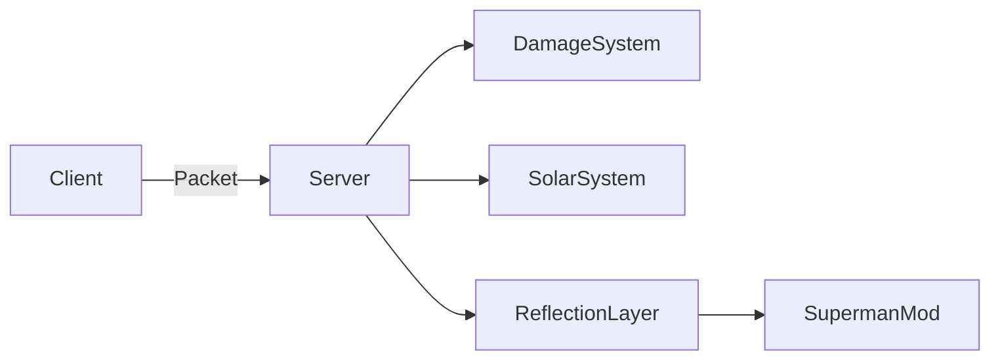

# 🦸‍♂️ Kryptonian Control

<p align="center">
  
  
  
  
  
</p>

<p align="center">
  ⚡ Transforme o gameplay kryptoniano em algo equilibrado, técnico e muito mais satisfatório
</p>

---

## 🎥 Showcase

[](https://postimg.cc/4KnrY4nt)


---

## 🔥 O que torna este addon único?

💡 Diferente de outros addons, este não apenas adiciona features — ele **reestrutura o sistema kryptoniano inteiro**:

* ⚔️ Sistema de dano totalmente reclassificado por categorias reais
* ☀️ Economia de energia solar com física e lógica mais realista
* 🧠 Heurísticas inteligentes para detectar dano mágico (Ars Nouveau, Mana & Artifice, etc.) fileciteturn1file0
* 🚫 Remoção da pseudo-invulnerabilidade "quebrada" do mod base
* 🎯 Controle fino de knockback e combate
* 🔥 Heat Vision agora funcional + performática
* ⛰️ Progressão baseada em altitude (endgame real)

---

## 🧬 Sistema Kryptoniano Reescrito

### ⚔️ Novo sistema de dano

Agora o dano NÃO é genérico — ele é classificado:

```diff
+ MAGIC
+ ENERGY_EXTREME
+ KRYPTONITE
+ PROJECTILE_SPECIAL
+ MELEE_PLAYER
+ EXPLOSIVE
```

### 🧠 Destaque: Dano mágico inteligente

O addon detecta automaticamente magia via:

* DamageType
* Entidade
* Namespace
* NBT

Compatível com:

* Ars Nouveau
* Mana and Artifice

👉 Resultado: magia finalmente relevante contra kryptonianos

---

## ☀️ Sistema de Energia Solar (Overhaul)

### 🔋 Consumo realista

Cada ação consome energia:

* ✈️ Voo (movimento + hover)
* 🏃 Super running
* 🔥 Heat vision (twin / focused)
* 💨 Breath powers
* 👁️ Visões (xray, night, hearing)

### 🚫 Sistema anti-exploit

* ❌ Sem ganho infinito de energia voando
* ❌ Poderes desligam automaticamente em 0 energia fileciteturn1file0
* ❌ Solar Flare bloqueado sem carga mínima

### 🌎 Recarga dinâmica

Baseado em:

* Clima ☁️
* Hora do dia 🌅
* Bioma 🌳
* Altitude ⛰️
* Dimensão 🌌
* Estações (Serene Seasons) 🍂

---

## ⛰️ Progressão por Altitude (Endgame)

```diff
+ Y >= 1500 desbloqueia evolução permanente
```

* ❤️ +20 vida permanente
* ⚡ Regeneração em alturas elevadas
* ☀️ Bônus massivo de energia

👉 Vira literalmente progressão de poder

---

## 🔥 Heat Vision 2.0

<p align="center">
  
</p>

### 💡 Melhorias

* 🔴 Twin (precisa e funcional)
* 🔵 Focused (controle total)
* ❌ Remove partículas pesadas
* ⚡ Renderer otimizado

### 🧪 Feature Única: Fundição em tempo real

```diff
+ Smelting com heat vision
```

* Funciona com itens no chão
* Usa receita de fornalha
* Consome energia solar
* Requer exposição contínua fileciteturn1file0

---

## 🛡️ Combate Balanceado

### Antes:

❌ Quase invulnerável

### Agora:

✔️ Resistente, mas vulnerável estrategicamente

* Dano mínimo garantido
* Bypass parcial de resistência
* PvP mais justo

---

## 🍗 Sistema de Fome Realista

```diff
- Superman ignorando fome ❌
+ Gameplay Minecraft normal ✔️
```

* Remove saturação artificial
* Consumo real de comida
* Regeneração equilibrada fileciteturn1file0

---

## 💥 Knockback & Combate Físico

* 👊 Soco não lança mobs absurdamente
* ⚙️ Knockback escalável
* 🔧 Armas perdem durabilidade
* ☀️ Ataques consomem energia

---

## 🎮 HUD & Experiência do Jogador

### Nova HUD Solar

* 📊 Barra compacta
* ⚠️ Alertas persistentes (low / critical)
* ❌ Remove HUD antiga poluída fileciteturn1file0

### Feedback em tempo real

* Super running ON/OFF
* Energia crítica

---

## 🧑‍💻 Arquitetura (Dev)



---

## ⚙️ Configuração

```toml
superman_toggle_addon-common.toml
```

Sistemas configuráveis:

* ⚔️ combat_balance
* ☀️ solar_energy
* 🔥 heat_vision_smelting

---

## 🚀 Instalação

```bash
1. Instale Forge 47.x
2. Instale Superman Mod 2.1.5+
3. Coloque o addon na pasta /mods
4. Inicie o jogo
```


## ⚠️ Limitações

* Depende de reflexão (pode quebrar com updates)
* Estado de super running não persiste

---

## 🧾 Resumo

Este addon transforma completamente o Superman:

* ⚔️ Combate equilibrado
* ☀️ Energia realista
* 🧠 Sistemas inteligentes
* 🎮 Gameplay mais desafiador

---

<p align="center">
  💙 Feito para quem quer um Superman forte — mas não quebrado
</p>

